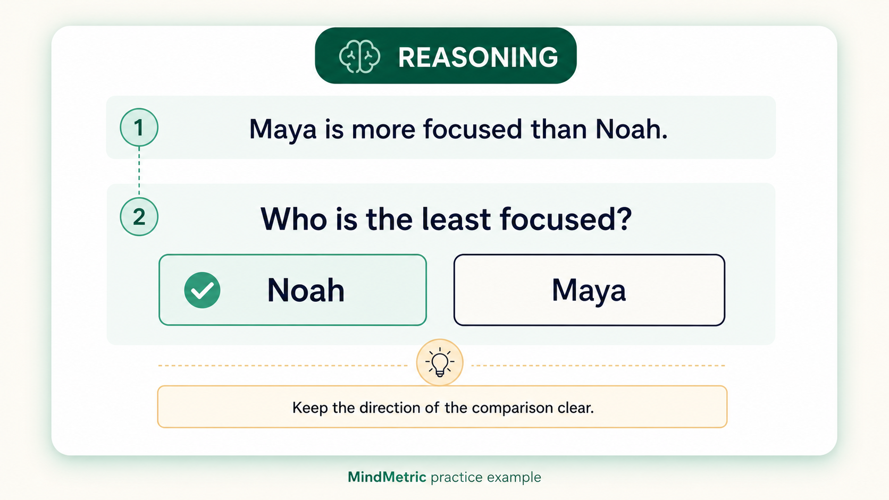
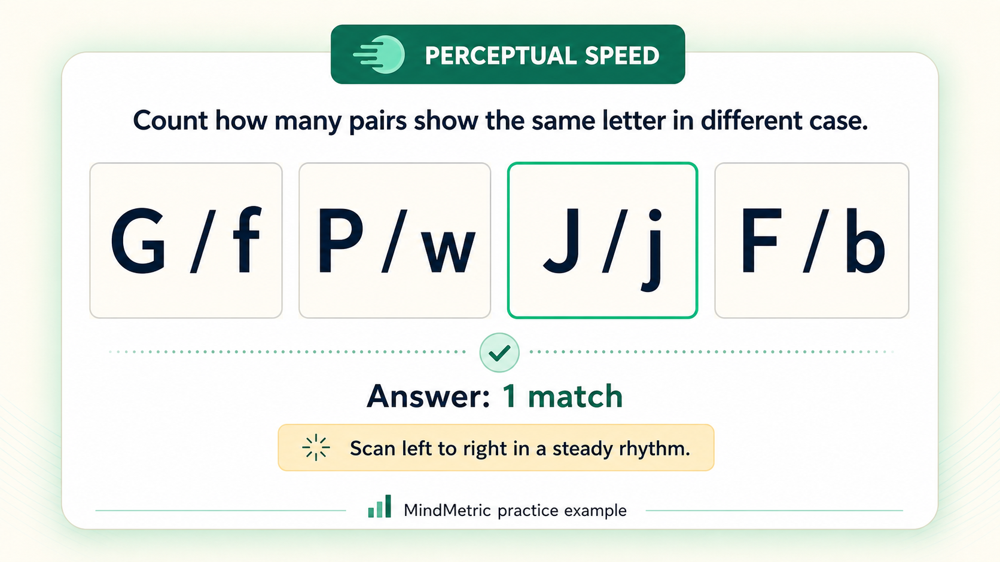
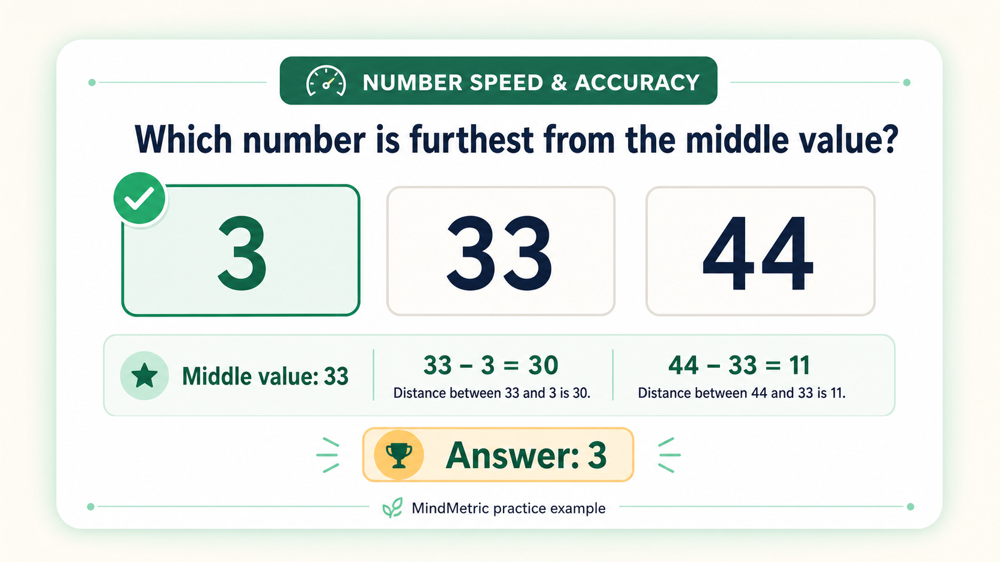
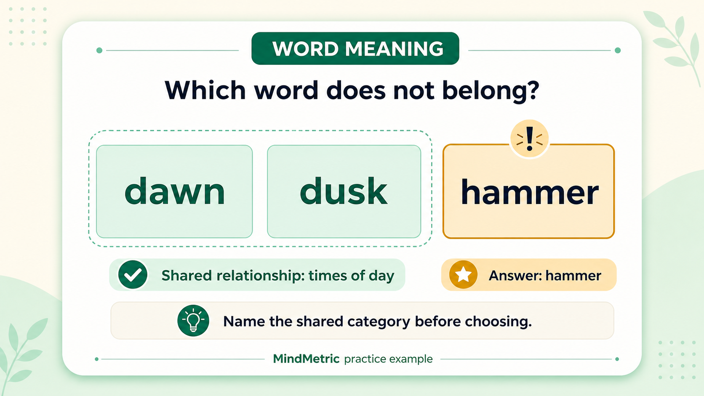
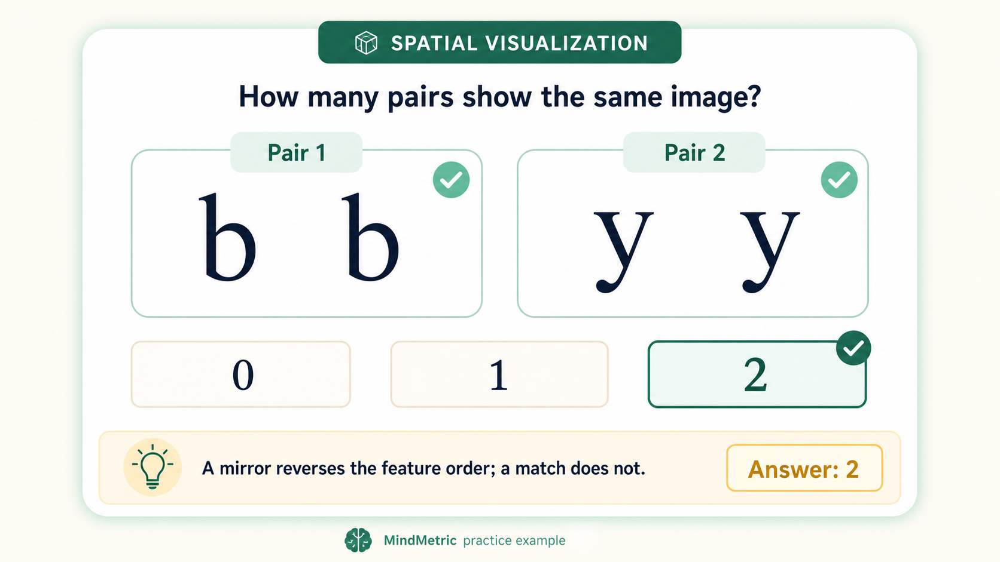

# The Thomas GIA Psychometric Test: What It Measures and How to Prepare

## A practical guide to the five cognitive sections, timed questions, and the habits that can help you perform at your best

If you have been invited to take a Thomas General Intelligence Assessment, or GIA, the first surprise may be how simple some of the questions look.

The real challenge is not advanced mathematics or specialist knowledge. It is processing straightforward information quickly, accurately, and consistently while the clock is running.

According to [Thomas International](https://www.thomas.co/assessments/general-intelligence-assessment-gia), the GIA is a cognitive ability assessment designed to explore how quickly a person can learn, adapt, and solve problems. It measures five areas:

1. Reasoning
2. Perceptual Speed
3. Number Speed and Accuracy
4. Word Meaning
5. Spatial Visualization

Together, these sections provide a picture of how someone processes new information. That is why employers may use the assessment alongside interviews, experience, and other evidence when considering a candidate's potential.

This guide explains what each section is trying to measure and how to approach GIA-style questions without relying on memorized answers.

## The GIA is about processing, not just knowledge

It is tempting to think of a cognitive assessment as an IQ quiz. The distinction matters.

The GIA focuses heavily on learning agility and processing speed: how efficiently you understand information, keep relevant details in mind, notice relationships, and reach a correct response. Thomas describes the assessment as measuring abilities connected to thought, language, decision-making, learning, and memory.

That means two things matter throughout the assessment:

- **Accuracy:** Can you understand the task and choose the correct response?
- **Speed:** Can you do that repeatedly within a limited period?

Rushing without a method creates avoidable errors. Working perfectly but too slowly limits the number of questions you can complete. Good preparation helps you find a controlled pace between those extremes.

## 1. Reasoning

The Reasoning section examines whether you can retain a relationship, interpret it correctly, and draw a conclusion.

A GIA-style practice task might first present a comparison between people or objects. You may then need to remember that relationship after the original statement is hidden and answer a related question.

### Practice example

One seeded MindMetric practice item presents this context:

> Maya is more focused than Noah.

After the statement is hidden, the question asks:

> Who is the least focused?

The answer is **Noah**. Maya is identified as the more focused person, so Noah must be the less focused person. The important step is preserving the direction of the original comparison when the wording changes from *more* to *least*.

### A reliable approach

1. Identify the people or things being compared.
2. Restate the relationship in simpler words.
3. Mentally place the stronger, larger, faster, or otherwise greater item first.
4. When the question appears, check whether its wording preserves or reverses the relationship.

### Common trap

Negative or reversed wording can turn a simple comparison into an incorrect answer. Words such as *less*, *not*, *slower*, or *least* deserve deliberate attention.

### What to practise

Practise translating short comparisons into a consistent mental format. The aim is not to remember the exact sentence. It is to preserve the relationship.

## 2. Perceptual Speed

Perceptual Speed measures how quickly and accurately you can recognize similarities, differences, and small errors.

In GIA-style practice, you may compare letter pairs and count how many pairs are exact matches. This tests disciplined visual scanning more than deep reasoning.

### Practice example

A generated MindMetric item contains these four pairs:

| Pair | Left | Right | Match? |
| --- | --- | --- | --- |
| 1 | G | f | No |
| 2 | P | w | No |
| 3 | J | j | Yes |
| 4 | F | b | No |

The instruction is to count pairs that show the same letter in different cases. Only `J / j` qualifies, so the correct answer is **1**.

This example shows why a quick glance is not enough. Each pair must be checked character by character, and the difference between uppercase and lowercase should be ignored only when the underlying letter is identical.

### A reliable approach

1. Scan from left to right.
2. Compare both characters in each pair.
3. Keep a running count.
4. Answer after completing the row rather than repeatedly checking earlier pairs.

### Common trap

A pair is not an exact match if only one character is the same. Under time pressure, the eye can register partial similarity and move on too quickly.

### What to practise

Use a steady scan rhythm. Accuracy often improves when your eyes follow the same path every time. Randomly jumping between pairs increases the chance of counting one twice or missing one completely.

## 3. Number Speed and Accuracy

This section measures comfort with basic numerical relationships and the ability to manipulate simple quantitative information quickly.

In one GIA-style task, you may see three numbers, identify the middle value, and decide which outer number is furthest from it.

### Practice example

A generated MindMetric item displays:

> 3, 33, 44

First, place the numbers in order. They are already ordered, so **33** is the middle value.

- The distance from 33 to 3 is `33 - 3 = 30`.
- The distance from 33 to 44 is `44 - 33 = 11`.

Because 30 is greater than 11, the number furthest from the middle value is **3**.

The arithmetic is elementary. The challenge is ordering the numbers, identifying the correct reference point, comparing the two distances, and responding without hesitation.

### A reliable approach

1. Order the three values from smallest to largest.
2. Identify the middle value.
3. Ignore the middle value once it has served its purpose.
4. Compare the two outer gaps.

### Common trap

The largest number is not automatically the answer. The question concerns distance from the middle, not absolute size.

### What to practise

Practise quick mental subtraction and comparison. Look for a repeatable process before trying to increase speed.

## 4. Word Meaning

Word Meaning examines vocabulary, verbal classification, and the ability to recognize how words relate to one another.

A typical GIA-style practice question presents a small set of words and asks you to identify the one that does not belong. Most words share a meaning, category, function, or association. One falls outside that relationship.

### Practice example from the word catalog

One active item in the MindMetric database contains:

> dawn, dusk, hammer

The stored relationship for **dawn** and **dusk** is *times of day*. A **hammer** is a tool and does not share that relationship, so it is the odd word.

The useful technique is to name the shared category before selecting an answer:

> Dawn and dusk are both times of day. Hammer is not. Therefore, hammer is the answer.

Real questions may be less obvious, especially when two possible relationships initially seem plausible.

### A reliable approach

1. Look for a category shared by most of the words.
2. Describe that category in one short phrase.
3. Test every word against it.
4. Select the word that does not fit the strongest shared relationship.

### Common trap

Do not choose a word merely because it is unfamiliar. Familiarity and category membership are different things.

### What to practise

Build vocabulary through reading, but also practise grouping words by meaning. Recognizing relationships is more useful here than memorizing isolated definitions.

## 5. Spatial Visualization

Spatial Visualization measures the ability to create and manipulate mental images.

In GIA-style practice, you may compare abstract shapes and decide whether they are the same shape after rotation or whether one has been mirrored.

Rotation preserves the arrangement of a shape's features. Reflection reverses that arrangement. A mirrored shape cannot be made identical through rotation alone.

### Practice example

A generated MindMetric item contains two pairs:

- A lowercase `b` beside the same unmirrored lowercase `b`
- A lowercase `y` beside the same unmirrored lowercase `y`

The question asks how many pairs show the same image. Both pairs preserve the original orientation, so the correct answer is **2**.

In a harder item, one of the second characters may be mirrored. The learner must then distinguish a genuine match from a reflection rather than relying on the character identity alone.

### A reliable approach

1. Choose one distinctive corner, mark, or asymmetric feature.
2. Mentally rotate the first shape until that feature aligns.
3. Track the neighboring features.
4. Decide whether their order remains the same or has been reversed.

### Common trap

Comparing the overall outline can make a reflection look like a rotation. A small asymmetric feature is usually a more dependable anchor.

### What to practise

Work with rotations and reflections, but explain your decision to yourself. Knowing *why* two shapes match builds a reusable skill; guessing based on appearance does not.

## Why practice questions should include feedback

Repeating questions is useful only when you understand your mistakes.

Immediate practice feedback can help you identify whether an incorrect response came from:

- Misunderstanding the rule
- Reversing a relationship
- Missing a small visual difference
- Performing the wrong numerical comparison
- Choosing a weak verbal category
- Confusing rotation with reflection
- Moving faster than your current accuracy allows

A productive practice session should therefore have two phases.

First, work without severe time pressure and correct your method. Then introduce timed sets and protect that method while gradually increasing your pace.

## A simple preparation plan

### Step 1: Learn each task separately

Do not begin with a full mock if the question mechanics are unfamiliar. Learn what each section asks you to do and create a repeatable sequence of steps.

### Step 2: Practise for accuracy

Complete short sets slowly enough to explain every response. Keep track of recurring errors rather than focusing only on the total score.

### Step 3: Add time pressure

Once your method is stable, use timed section practice. MindMetric's GIA-style drills use focused section timers of five minutes for Reasoning, two minutes for Perceptual Speed, two minutes for Number Speed and Accuracy, three minutes for Word Meaning, and two minutes for Spatial Visualization.

These are practice settings designed to build speed and should not be treated as a guarantee of the exact format or timing you will receive from an employer.

### Step 4: Combine the sections

Use a full practice flow to experience switching between different cognitive tasks. The change from verbal relationships to visual matching or numerical comparison is part of the mental demand.

### Step 5: Review patterns, not individual answers

Ask:

- Which section causes the most hesitation?
- Where do I sacrifice accuracy for speed?
- Which instruction do I repeatedly forget?
- Do my errors occur early, or only after fatigue builds?

Your review should produce a change in technique, not just another score.

## Test-day habits that help

- Read every instruction carefully, even if you have practised similar questions.
- Use the practice examples provided by the assessment to confirm the exact rule.
- Work quickly, but avoid frantic clicking.
- If one item feels unusually difficult, do not let it disrupt your rhythm.
- Keep your attention on the current task instead of estimating your score.
- Take the assessment in a quiet environment with a stable internet connection.
- Inform the test administrator if a technical, health, or accessibility issue could affect your performance.

## What your result does and does not mean

A GIA result is evidence about performance on a set of cognitive tasks under specific conditions. It is not a complete definition of intelligence, employability, personality, experience, motivation, or future success.

Thomas notes that the assessment is commonly used to understand abilities related to learning and adapting at work. A responsible hiring process should interpret that information alongside other relevant evidence.

For candidates, the most useful preparation goal is not to memorize questions. It is to become familiar with the task types, reduce avoidable errors, and demonstrate your natural processing ability without losing time to confusion.

## Final thought

The Thomas GIA feels fast because each section asks for a different kind of mental control: retaining a relationship, scanning details, comparing quantities, categorizing words, or rotating shapes.

The best preparation is equally varied. Learn the rule, build a stable method, practise accurately, and only then add speed.

When test day arrives, you should not be seeing the task mechanics for the first time. You should be free to focus on the questions themselves.

---

**Practise Thomas GIA-style questions on [MindMetric](https://mindmetric.store/practice/prepgia/)** with guided module drills, immediate practice feedback, and timed full-test flows.

*MindMetric is an independent practice platform and is not affiliated with or endorsed by Thomas International. Thomas and GIA are trademarks of their respective owner. Practice content is illustrative and does not reproduce live assessment questions.*

## Suggested Medium metadata

**Subtitle:** Understand all five Thomas GIA sections and build a preparation strategy that balances speed with accuracy.

**Tags:** Psychometric Tests, Aptitude Tests, Career Advice, Job Interviews, Cognitive Ability

**Suggested preview text:** The Thomas GIA is not about advanced knowledge. It tests how quickly and accurately you process five different kinds of information. Here is what each section measures and how to prepare.
